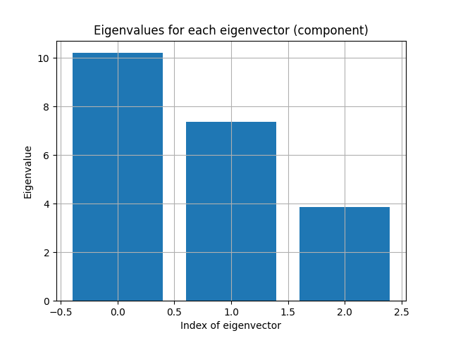
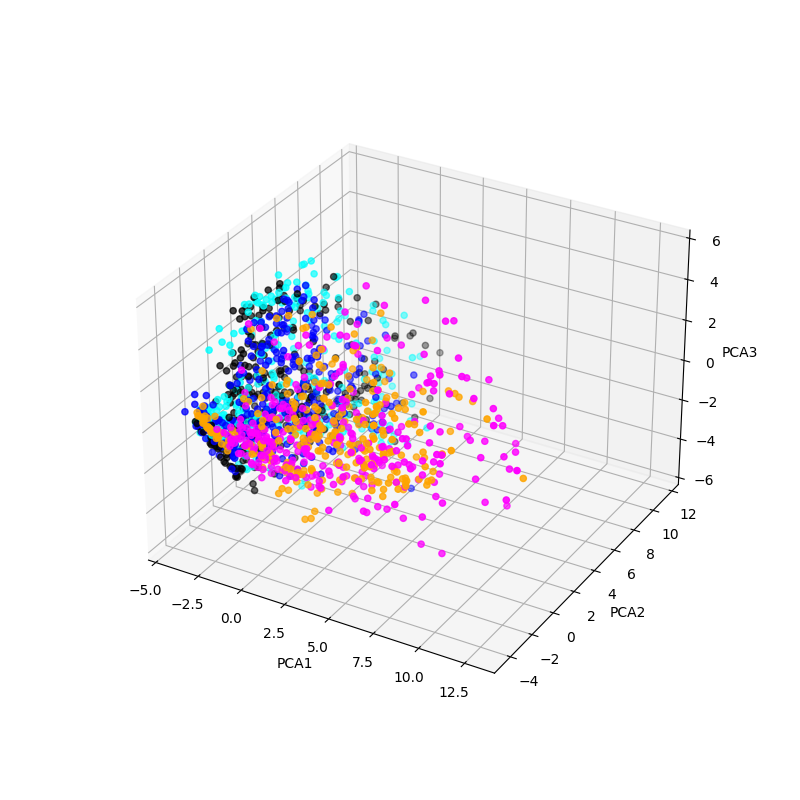
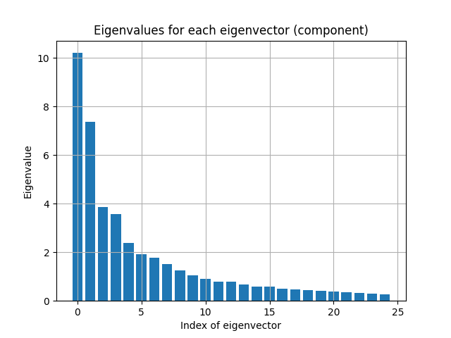
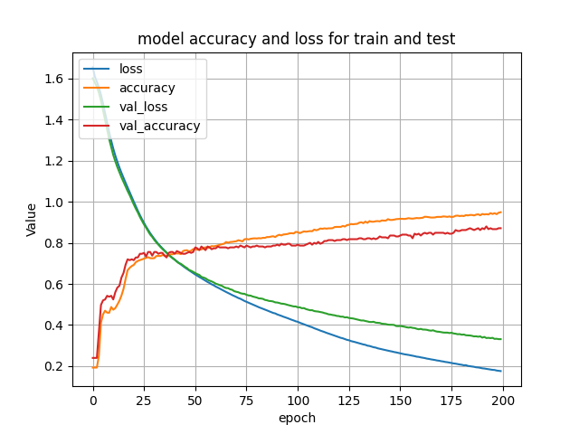

# Spoken Digit Recognition

Firstly import needed libraries:


```python
!pip3 show seaborn
%matplotlib
try:
    # Wavfile libraries
    from scipy.io.wavfile import read
    from librosa import get_duration
    # ML libraries
    from sklearn.model_selection import train_test_split
    from sklearn.metrics import f1_score
    from sklearn.decomposition import PCA
    from sklearn.preprocessing import StandardScaler
    # FFT libs
    from scipy.fft import fft, ifft, fftfreq
    # Own libs
    from utils import *
    # Other
    import os
    import re
    import seaborn as sb
except:
    print("\n\nSomething is wrong\n\n")
```

    Name: seaborn
    Version: 0.12.2
    Summary: Statistical data visualization
    Home-page: 
    Author: 
    Author-email: Michael Waskom <mwaskom@gmail.com>
    License: 
    Location: /home/krystian/anaconda3/envs/conda-env/lib/python3.8/site-packages
    Requires: matplotlib, numpy, pandas
    Required-by: 
    Using matplotlib backend: module://ipympl.backend_nbagg


    2023-02-20 18:50:33.181909: I tensorflow/core/platform/cpu_feature_guard.cc:193] This TensorFlow binary is optimized with oneAPI Deep Neural Network Library (oneDNN) to use the following CPU instructions in performance-critical operations:  AVX2 FMA
    To enable them in other operations, rebuild TensorFlow with the appropriate compiler flags.
    2023-02-20 18:50:33.272454: W tensorflow/stream_executor/platform/default/dso_loader.cc:64] Could not load dynamic library 'libcudart.so.11.0'; dlerror: libcudart.so.11.0: cannot open shared object file: No such file or directory
    2023-02-20 18:50:33.272467: I tensorflow/stream_executor/cuda/cudart_stub.cc:29] Ignore above cudart dlerror if you do not have a GPU set up on your machine.
    2023-02-20 18:50:33.291546: E tensorflow/stream_executor/cuda/cuda_blas.cc:2981] Unable to register cuBLAS factory: Attempting to register factory for plugin cuBLAS when one has already been registered
    2023-02-20 18:50:33.752346: W tensorflow/stream_executor/platform/default/dso_loader.cc:64] Could not load dynamic library 'libnvinfer.so.7'; dlerror: libnvinfer.so.7: cannot open shared object file: No such file or directory
    2023-02-20 18:50:33.752434: W tensorflow/stream_executor/platform/default/dso_loader.cc:64] Could not load dynamic library 'libnvinfer_plugin.so.7'; dlerror: libnvinfer_plugin.so.7: cannot open shared object file: No such file or directory
    2023-02-20 18:50:33.752439: W tensorflow/compiler/tf2tensorrt/utils/py_utils.cc:38] TF-TRT Warning: Cannot dlopen some TensorRT libraries. If you would like to use Nvidia GPU with TensorRT, please make sure the missing libraries mentioned above are installed properly.


Some functions to not duplicate code:


```python
# Fast plotting
def plot_signal(X, Y, xlabel, ylabel, title):
    plt.figure()
    plt.plot(X, Y)
    plt.grid()
    plt.xlabel(xlabel)
    plt.ylabel(ylabel)
    plt.title(title)
```

Then dataset should be downloaded (source: https://github.com/TaskAccount/free-spoken-digit-dataset/tree/master/recordings). GlobalVariables is class created to make it easier to store significant data:


```python

# ---------------------------------------------------------------------------------
# Read all recordings
records_dir = os.path.dirname(os.path.realpath('__file__')) + '/recordings/'
GlobVar = GlobalVariables()
save_or_load_csv = 1
LABEL_NUMBER = 5

if save_or_load_csv == 1:
    for wavfile in os.listdir(records_dir):
        number = int(wavfile[0])
        number_vec = np.zeros(LABEL_NUMBER)
        number_vec[number] = 1
        name, sample_id = re.findall(r'_(.*)_(.*).wav', wavfile)[0]
        signal = np.array(read(records_dir + wavfile)[1], dtype=float)
        f, y_signal = read(records_dir + wavfile)


        if GlobVar.MAX_SAMPLES < signal.shape[0]:
            GlobVar.MAX_SAMPLES = signal.shape[0]
        if GlobVar.MAX_VALUE < np.max(signal):
            GlobVar.MAX_VALUE = np.max(signal)
        if GlobVar.MIN_SAMPLES > signal.shape[0]:
            GlobVar.MIN_SAMPLES = signal.shape[0]

        data = {
            "id": sample_id,
            "name": name,
            "duration": float(get_duration(filename=records_dir + wavfile)),
            "signal": [signal],
            "signal_shape": signal.shape,
            "number_vec": [number_vec.tolist()],
            "number": [number]
        }

        GlobVar.all_records.append(data)
        GlobVar.df_records = pd.concat(
            [GlobVar.df_records, pd.DataFrame(data)], ignore_index=True, axis=0)
        GlobVar.sorted_records[number].append(signal)

    for index, sig in enumerate(GlobVar.df_records["signal"]):
        zero_vec = np.zeros(GlobVar.MAX_SAMPLES)
        zero_vec[0:sig.shape[0]] = sig/GlobVar.MAX_VALUE
        GlobVar.df_records["signal"][index] = zero_vec.tolist()
        GlobVar.df_records["signal_shape"][index] = zero_vec.shape[0]
        GlobVar.all_records[index] = zero_vec.tolist()
        GlobVar.sorted_records[GlobVar.df_records["number"][index]] = zero_vec.tolist()

    # GlobVar.df_records.to_parquet('dataframe.parquet')
if save_or_load_csv == 2:
    GlobVar.df_records = pd.read_parquet('dataframe.parquet')

y_fft_list = []
x_fft_list = []
for signal in GlobVar.df_records["signal"]:
    T = 1.0/f
    N = len(signal)
    N_fft = N//2
    y_fft = fft(signal,2**14)
    y_fft = np.abs(y_fft)
    y_fft = y_fft[0:N_fft]
    y_fft = y_fft/y_fft.max()
    x_fft = fftfreq(N, T)[:N_fft]
    y_fft_list.append(y_fft)
    x_fft_list.append(x_fft)
    if False:    
        plot_signal(x_fft, np.abs(y_fft[:N_fft]), "Frequency [Hz]",
                    "Amplitude", f"Number {number} of person {name}")
        plt.show()

GlobVar.df_records.insert(loc=len(GlobVar.df_records.columns), column="y_fft", value=y_fft_list)
GlobVar.df_records.insert(loc=len(GlobVar.df_records.columns), column="x_fft", value=x_fft_list)

df_train, df_test = train_test_split(GlobVar.df_records, train_size=0.75)
```

    /tmp/ipykernel_47218/3219922721.py:43: SettingWithCopyWarning: 
    A value is trying to be set on a copy of a slice from a DataFrame
    
    See the caveats in the documentation: https://pandas.pydata.org/pandas-docs/stable/user_guide/indexing.html#returning-a-view-versus-a-copy
      GlobVar.df_records["signal"][index] = zero_vec.tolist()
    /tmp/ipykernel_47218/3219922721.py:44: SettingWithCopyWarning: 
    A value is trying to be set on a copy of a slice from a DataFrame
    
    See the caveats in the documentation: https://pandas.pydata.org/pandas-docs/stable/user_guide/indexing.html#returning-a-view-versus-a-copy
      GlobVar.df_records["signal_shape"][index] = zero_vec.shape[0]


Our DataFrame object looks as follow:


```python
GlobVar.df_records.head()
```


<div>
<style scoped>
    .dataframe tbody tr th:only-of-type {
        vertical-align: middle;
    }

    .dataframe tbody tr th {
        vertical-align: top;
    }

    .dataframe thead th {
        text-align: right;
    }
</style>
<table border="1" class="dataframe">
  <thead>
    <tr style="text-align: right;">
      <th></th>
      <th>id</th>
      <th>name</th>
      <th>duration</th>
      <th>signal</th>
      <th>signal_shape</th>
      <th>number_vec</th>
      <th>number</th>
      <th>y_fft</th>
      <th>x_fft</th>
    </tr>
  </thead>
  <tbody>
    <tr>
      <th>0</th>
      <td>48</td>
      <td>lucas</td>
      <td>0.745875</td>
      <td>[-0.0004989486439288641, 0.0005702270216329876...</td>
      <td>10504</td>
      <td>[1.0, 0.0, 0.0, 0.0, 0.0]</td>
      <td>0</td>
      <td>[0.0004569215912878094, 0.0005132062429625317,...</td>
      <td>[0.0, 0.7616146230007617, 1.5232292460015233, ...</td>
    </tr>
    <tr>
      <th>1</th>
      <td>14</td>
      <td>theo</td>
      <td>0.247000</td>
      <td>[-0.0008553405324494814, -0.000997897287857728...</td>
      <td>10504</td>
      <td>[0.0, 1.0, 0.0, 0.0, 0.0]</td>
      <td>1</td>
      <td>[0.008229033748731351, 0.00836463983882965, 0....</td>
      <td>[0.0, 0.7616146230007617, 1.5232292460015233, ...</td>
    </tr>
    <tr>
      <th>2</th>
      <td>24</td>
      <td>jackson</td>
      <td>0.522500</td>
      <td>[-0.018924409280444778, -0.000784062154745358,...</td>
      <td>10504</td>
      <td>[0.0, 0.0, 1.0, 0.0, 0.0]</td>
      <td>2</td>
      <td>[0.0004293666769113728, 0.0003052477303523035,...</td>
      <td>[0.0, 0.7616146230007617, 1.5232292460015233, ...</td>
    </tr>
    <tr>
      <th>3</th>
      <td>23</td>
      <td>george</td>
      <td>0.367500</td>
      <td>[-0.0025660215973484445, -0.003243166185537617...</td>
      <td>10504</td>
      <td>[0.0, 1.0, 0.0, 0.0, 0.0]</td>
      <td>1</td>
      <td>[0.0016027004768143424, 0.0015479752199825962,...</td>
      <td>[0.0, 0.7616146230007617, 1.5232292460015233, ...</td>
    </tr>
    <tr>
      <th>4</th>
      <td>41</td>
      <td>lucas</td>
      <td>0.554250</td>
      <td>[-0.0012473716098221604, 0.0037421148294664816...</td>
      <td>10504</td>
      <td>[1.0, 0.0, 0.0, 0.0, 0.0]</td>
      <td>0</td>
      <td>[0.0007829354427421963, 0.0008894177438707432,...</td>
      <td>[0.0, 0.7616146230007617, 1.5232292460015233, ...</td>
    </tr>
  </tbody>
</table>
</div>


The most important informations for us is the signal (array of the samples), y_fft which are our signals in frequency-domain and number/number_vec which describes our labels (presented as an exact number and one-hot-encoding version).

Because of the fact that time-domain signal is not sufficient to use it as an input for our model we need to use frequency-domain signal. But there is no trade-off for number of signal dimensions and number of samples. That is why I decided to apply dimensional reduction method - PCA (Principal Component analysis):


```python
# ---------------------------------------------------------------------------------
# PCA
%matplotlib notebook
J = 3
pca = PCA(n_components= J)

X_pca_fft = GlobVar.df_records["y_fft"].tolist()
check_me = pca.fit(X_pca_fft)
var = check_me.explained_variance_
indices = [each for each in range(var.size)]
plt.figure()
plt.bar(indices, height=var)
plt.grid()
plt.xlabel("Index of eigenvector")
plt.ylabel("Eigenvalue")
plt.title("Eigenvalues for each eigenvector (component)")
plt.show()

train_pca = pca.transform(X_pca_fft)

keys = {}
for i in range(J):
    ii = i+1
    keys[str(ii)] = train_pca[:, i]

train_pca = pd.DataFrame(keys)
# train_pca = pd.DataFrame({'First': train_pca[:, 0], 'Second': train_pca[:, 1], 'Third': train_pca[:, 2]})

train_pca = train_pca.join(GlobVar.df_records["number_vec"])
train_pca = train_pca.join(GlobVar.df_records["number"])

if J == 3:
    colors = {0:'blue', 1:'magenta', 2:'black', 3:'cyan', 4:'orange', 5:'green', 6:'red', 7:'purple', 8:'brown', 9:'pink'}

    fig = plt.figure(figsize=(8,8))
    ax = plt.axes(projection='3d')
    ax.scatter3D(train_pca['1'], train_pca['2'], train_pca['3'], c=train_pca['number'].map(colors))

    ax.set_xlabel('PCA1')
    ax.set_ylabel('PCA2')
    ax.set_zlabel('PCA3')
    plt.show()
```

    Warning: Cannot change to a different GUI toolkit: notebook. Using widget instead.


<div style="display: inline-block;">
    <div class="jupyter-widgets widget-label" style="text-align: center;">
        Figure
    </div>
    
</div>


<div style="display: inline-block;">
    <div class="jupyter-widgets widget-label" style="text-align: center;">
        Figure
    </div>
    
</div>


As we can see our data with NxF dimensions (N - number of samples and F number of each frequency) has been reduced to matrix NxJ (where J is number of PCA components). Eigenvalues for those components are relatively high so let's consider greater amount of them:


```python
# ---------------------------------------------------------------------------------
# PCA
J = 25
pca = PCA(n_components= J)

X_pca_fft = GlobVar.df_records["y_fft"].tolist()
check_me = pca.fit(X_pca_fft)
var = check_me.explained_variance_
indices = [each for each in range(var.size)]
plt.figure()
plt.bar(indices, height=var)
plt.grid()
plt.xlabel("Index of eigenvector")
plt.ylabel("Eigenvalue")
plt.title("Eigenvalues for each eigenvector (component)")
plt.show()

train_pca = pca.transform(X_pca_fft)

keys = {}
for i in range(J):
    ii = i+1
    keys[str(ii)] = train_pca[:, i]

train_pca = pd.DataFrame(keys)

train_pca = train_pca.join(GlobVar.df_records["number_vec"])
train_pca = train_pca.join(GlobVar.df_records["number"])

if J == 3:
    colors = {0:'blue', 1:'magenta', 2:'black', 3:'cyan', 4:'orange', 5:'green', 6:'red', 7:'purple', 8:'brown', 9:'pink'}

    fig = plt.figure(figsize=(8,8))
    ax = plt.axes(projection='3d')
    ax.scatter3D(train_pca['1'], train_pca['2'], train_pca['3'], c=train_pca['number'].map(colors))

    ax.set_xlabel('PCA1')
    ax.set_ylabel('PCA2')
    ax.set_zlabel('PCA3')
    plt.show()
```


<div style="display: inline-block;">
    <div class="jupyter-widgets widget-label" style="text-align: center;">
        Figure
    </div>
    
</div>


Here we can notice that the eigenvalues for eigenvectors of indices 20 and more are not so different. That is why we will remain this number of components.

For now we have our input data prepared. It's time to implement our recognition model.


```python

# ---------------------------------------------------------------------------------
# Neural Network

df_train, df_test = train_test_split(train_pca, train_size=0.85)
activ = "sigmoid"
model = tf.keras.Sequential([
    tf.keras.layers.Input(shape=(J)),
    tf.keras.layers.Dense(100, activation=activ),
    tf.keras.layers.Dense(25, activation=activ),
    tf.keras.layers.Dense(8, activation=activ),
    # tf.keras.layers.Dense(4, activation=activ),
    tf.keras.layers.Dense(LABEL_NUMBER, activation="softmax")
])

model.compile(optimizer=tf.keras.optimizers.Adam(learning_rate=0.0005),
              loss=tf.keras.losses.CategoricalCrossentropy(),
              metrics=["accuracy"])

X = df_train.iloc[:, [each for each in range(J)]].values.tolist()
Y = df_train["number_vec"].tolist()

X_test = df_test.iloc[:, [each for each in range(J)]].values.tolist()
Y_test = df_test["number_vec"].tolist()

save_or_load = 1
if save_or_load == 1:
    history = model.fit(x=X, y=Y, epochs=200,verbose=2, validation_data=(X_test,Y_test))
    print(history.history.keys())
    plt.figure()
    plt.plot(history.history['loss'])
    plt.plot(history.history['accuracy'])
    plt.plot(history.history['val_loss'])
    plt.plot(history.history['val_accuracy'])
    plt.title('model accuracy and loss for train and test')
    plt.ylabel('Value')
    plt.xlabel('epoch')
    plt.legend(['loss', 'accuracy','val_loss', 'val_accuracy'], loc='upper left')
    plt.grid()
    plt.show()
    # model.save("model.h")
if save_or_load == 2:
    # model = tf.keras.models.load_model('model.h')
    pass
```

    2023-02-20 18:09:55.785157: E tensorflow/stream_executor/cuda/cuda_driver.cc:265] failed call to cuInit: CUDA_ERROR_NO_DEVICE: no CUDA-capable device is detected
    2023-02-20 18:09:55.785197: I tensorflow/stream_executor/cuda/cuda_diagnostics.cc:156] kernel driver does not appear to be running on this host (Lambadziara): /proc/driver/nvidia/version does not exist
    2023-02-20 18:09:55.785995: I tensorflow/core/platform/cpu_feature_guard.cc:193] This TensorFlow binary is optimized with oneAPI Deep Neural Network Library (oneDNN) to use the following CPU instructions in performance-critical operations:  AVX2 FMA
    To enable them in other operations, rebuild TensorFlow with the appropriate compiler flags.


    Epoch 1/200
    40/40 - 1s - loss: 1.6544 - accuracy: 0.1929 - val_loss: 1.6007 - val_accuracy: 0.2400 - 875ms/epoch - 22ms/step
    Epoch 2/200
    40/40 - 0s - loss: 1.6092 - accuracy: 0.1929 - val_loss: 1.5800 - val_accuracy: 0.2400 - 67ms/epoch - 2ms/step
    Epoch 3/200
    40/40 - 0s - loss: 1.5838 - accuracy: 0.1929 - val_loss: 1.5597 - val_accuracy: 0.2400 - 68ms/epoch - 2ms/step
    Epoch 4/200
    40/40 - 0s - loss: 1.5558 - accuracy: 0.2518 - val_loss: 1.5301 - val_accuracy: 0.3689 - 61ms/epoch - 2ms/step
    Epoch 5/200
    40/40 - 0s - loss: 1.5211 - accuracy: 0.4118 - val_loss: 1.4921 - val_accuracy: 0.4978 - 65ms/epoch - 2ms/step
    Epoch 6/200
    40/40 - 0s - loss: 1.4782 - accuracy: 0.4518 - val_loss: 1.4452 - val_accuracy: 0.5200 - 65ms/epoch - 2ms/step
    Epoch 7/200
    40/40 - 0s - loss: 1.4313 - accuracy: 0.4698 - val_loss: 1.3961 - val_accuracy: 0.5244 - 64ms/epoch - 2ms/step
    Epoch 8/200
    40/40 - 0s - loss: 1.3841 - accuracy: 0.4604 - val_loss: 1.3497 - val_accuracy: 0.5422 - 63ms/epoch - 2ms/step
    Epoch 9/200
    40/40 - 0s - loss: 1.3390 - accuracy: 0.4596 - val_loss: 1.3044 - val_accuracy: 0.5378 - 78ms/epoch - 2ms/step
    Epoch 10/200
    40/40 - 0s - loss: 1.2970 - accuracy: 0.4878 - val_loss: 1.2657 - val_accuracy: 0.5422 - 77ms/epoch - 2ms/step
    Epoch 11/200
    40/40 - 0s - loss: 1.2587 - accuracy: 0.4745 - val_loss: 1.2275 - val_accuracy: 0.5244 - 73ms/epoch - 2ms/step
    Epoch 12/200
    40/40 - 0s - loss: 1.2245 - accuracy: 0.4824 - val_loss: 1.1967 - val_accuracy: 0.5600 - 61ms/epoch - 2ms/step
    Epoch 13/200
    40/40 - 0s - loss: 1.1940 - accuracy: 0.4996 - val_loss: 1.1685 - val_accuracy: 0.5822 - 66ms/epoch - 2ms/step
    Epoch 14/200
    40/40 - 0s - loss: 1.1665 - accuracy: 0.5184 - val_loss: 1.1434 - val_accuracy: 0.5911 - 67ms/epoch - 2ms/step
    Epoch 15/200
    40/40 - 0s - loss: 1.1406 - accuracy: 0.5435 - val_loss: 1.1189 - val_accuracy: 0.6311 - 63ms/epoch - 2ms/step
    Epoch 16/200
    40/40 - 0s - loss: 1.1162 - accuracy: 0.5757 - val_loss: 1.0972 - val_accuracy: 0.6533 - 66ms/epoch - 2ms/step
    Epoch 17/200
    40/40 - 0s - loss: 1.0928 - accuracy: 0.6235 - val_loss: 1.0745 - val_accuracy: 0.6933 - 66ms/epoch - 2ms/step
    Epoch 18/200
    40/40 - 0s - loss: 1.0694 - accuracy: 0.6667 - val_loss: 1.0520 - val_accuracy: 0.7200 - 62ms/epoch - 2ms/step
    Epoch 19/200
    40/40 - 0s - loss: 1.0463 - accuracy: 0.6784 - val_loss: 1.0322 - val_accuracy: 0.7156 - 62ms/epoch - 2ms/step
    Epoch 20/200
    40/40 - 0s - loss: 1.0230 - accuracy: 0.6871 - val_loss: 1.0090 - val_accuracy: 0.7200 - 63ms/epoch - 2ms/step
    Epoch 21/200
    40/40 - 0s - loss: 1.0004 - accuracy: 0.6925 - val_loss: 0.9871 - val_accuracy: 0.7156 - 75ms/epoch - 2ms/step
    Epoch 22/200
    40/40 - 0s - loss: 0.9776 - accuracy: 0.7059 - val_loss: 0.9661 - val_accuracy: 0.7289 - 73ms/epoch - 2ms/step
    Epoch 23/200
    40/40 - 0s - loss: 0.9558 - accuracy: 0.7122 - val_loss: 0.9474 - val_accuracy: 0.7289 - 66ms/epoch - 2ms/step
    Epoch 24/200
    40/40 - 0s - loss: 0.9349 - accuracy: 0.7161 - val_loss: 0.9258 - val_accuracy: 0.7467 - 62ms/epoch - 2ms/step
    Epoch 25/200
    40/40 - 0s - loss: 0.9151 - accuracy: 0.7192 - val_loss: 0.9072 - val_accuracy: 0.7467 - 61ms/epoch - 2ms/step
    Epoch 26/200
    40/40 - 0s - loss: 0.8966 - accuracy: 0.7231 - val_loss: 0.8890 - val_accuracy: 0.7511 - 62ms/epoch - 2ms/step
    Epoch 27/200
    40/40 - 0s - loss: 0.8790 - accuracy: 0.7271 - val_loss: 0.8742 - val_accuracy: 0.7333 - 65ms/epoch - 2ms/step
    Epoch 28/200
    40/40 - 0s - loss: 0.8627 - accuracy: 0.7302 - val_loss: 0.8567 - val_accuracy: 0.7556 - 69ms/epoch - 2ms/step
    Epoch 29/200
    40/40 - 0s - loss: 0.8471 - accuracy: 0.7255 - val_loss: 0.8404 - val_accuracy: 0.7556 - 67ms/epoch - 2ms/step
    Epoch 30/200
    40/40 - 0s - loss: 0.8328 - accuracy: 0.7247 - val_loss: 0.8290 - val_accuracy: 0.7378 - 73ms/epoch - 2ms/step
    Epoch 31/200
    40/40 - 0s - loss: 0.8194 - accuracy: 0.7255 - val_loss: 0.8144 - val_accuracy: 0.7556 - 78ms/epoch - 2ms/step
    Epoch 32/200
    40/40 - 0s - loss: 0.8064 - accuracy: 0.7357 - val_loss: 0.8023 - val_accuracy: 0.7556 - 68ms/epoch - 2ms/step
    Epoch 33/200
    40/40 - 0s - loss: 0.7940 - accuracy: 0.7365 - val_loss: 0.7913 - val_accuracy: 0.7467 - 67ms/epoch - 2ms/step
    Epoch 34/200
    40/40 - 0s - loss: 0.7834 - accuracy: 0.7357 - val_loss: 0.7801 - val_accuracy: 0.7511 - 79ms/epoch - 2ms/step
    Epoch 35/200
    40/40 - 0s - loss: 0.7728 - accuracy: 0.7404 - val_loss: 0.7702 - val_accuracy: 0.7511 - 72ms/epoch - 2ms/step
    Epoch 36/200
    40/40 - 0s - loss: 0.7622 - accuracy: 0.7388 - val_loss: 0.7613 - val_accuracy: 0.7378 - 61ms/epoch - 2ms/step
    Epoch 37/200
    40/40 - 0s - loss: 0.7523 - accuracy: 0.7357 - val_loss: 0.7520 - val_accuracy: 0.7289 - 64ms/epoch - 2ms/step
    Epoch 38/200
    40/40 - 0s - loss: 0.7433 - accuracy: 0.7388 - val_loss: 0.7420 - val_accuracy: 0.7511 - 71ms/epoch - 2ms/step
    Epoch 39/200
    40/40 - 0s - loss: 0.7341 - accuracy: 0.7443 - val_loss: 0.7322 - val_accuracy: 0.7556 - 65ms/epoch - 2ms/step
    Epoch 40/200
    40/40 - 0s - loss: 0.7261 - accuracy: 0.7443 - val_loss: 0.7247 - val_accuracy: 0.7556 - 62ms/epoch - 2ms/step
    Epoch 41/200
    40/40 - 0s - loss: 0.7175 - accuracy: 0.7490 - val_loss: 0.7183 - val_accuracy: 0.7467 - 62ms/epoch - 2ms/step
    Epoch 42/200
    40/40 - 0s - loss: 0.7097 - accuracy: 0.7482 - val_loss: 0.7086 - val_accuracy: 0.7600 - 65ms/epoch - 2ms/step
    Epoch 43/200
    40/40 - 0s - loss: 0.7022 - accuracy: 0.7482 - val_loss: 0.7010 - val_accuracy: 0.7556 - 62ms/epoch - 2ms/step
    Epoch 44/200
    40/40 - 0s - loss: 0.6945 - accuracy: 0.7451 - val_loss: 0.6978 - val_accuracy: 0.7511 - 63ms/epoch - 2ms/step
    Epoch 45/200
    40/40 - 0s - loss: 0.6870 - accuracy: 0.7600 - val_loss: 0.6906 - val_accuracy: 0.7467 - 62ms/epoch - 2ms/step
    Epoch 46/200
    40/40 - 0s - loss: 0.6795 - accuracy: 0.7631 - val_loss: 0.6830 - val_accuracy: 0.7467 - 62ms/epoch - 2ms/step
    Epoch 47/200
    40/40 - 0s - loss: 0.6728 - accuracy: 0.7639 - val_loss: 0.6771 - val_accuracy: 0.7511 - 62ms/epoch - 2ms/step
    Epoch 48/200
    40/40 - 0s - loss: 0.6660 - accuracy: 0.7576 - val_loss: 0.6681 - val_accuracy: 0.7556 - 62ms/epoch - 2ms/step
    Epoch 49/200
    40/40 - 0s - loss: 0.6587 - accuracy: 0.7624 - val_loss: 0.6641 - val_accuracy: 0.7511 - 63ms/epoch - 2ms/step
    Epoch 50/200
    40/40 - 0s - loss: 0.6523 - accuracy: 0.7694 - val_loss: 0.6584 - val_accuracy: 0.7556 - 62ms/epoch - 2ms/step
    Epoch 51/200
    40/40 - 0s - loss: 0.6459 - accuracy: 0.7702 - val_loss: 0.6527 - val_accuracy: 0.7778 - 59ms/epoch - 1ms/step
    Epoch 52/200
    40/40 - 0s - loss: 0.6400 - accuracy: 0.7663 - val_loss: 0.6476 - val_accuracy: 0.7733 - 65ms/epoch - 2ms/step
    Epoch 53/200
    40/40 - 0s - loss: 0.6336 - accuracy: 0.7671 - val_loss: 0.6438 - val_accuracy: 0.7644 - 62ms/epoch - 2ms/step
    Epoch 54/200
    40/40 - 0s - loss: 0.6280 - accuracy: 0.7678 - val_loss: 0.6343 - val_accuracy: 0.7822 - 63ms/epoch - 2ms/step
    Epoch 55/200
    40/40 - 0s - loss: 0.6217 - accuracy: 0.7733 - val_loss: 0.6312 - val_accuracy: 0.7733 - 61ms/epoch - 2ms/step
    Epoch 56/200
    40/40 - 0s - loss: 0.6156 - accuracy: 0.7788 - val_loss: 0.6274 - val_accuracy: 0.7644 - 61ms/epoch - 2ms/step
    Epoch 57/200
    40/40 - 0s - loss: 0.6096 - accuracy: 0.7749 - val_loss: 0.6205 - val_accuracy: 0.7822 - 63ms/epoch - 2ms/step
    Epoch 58/200
    40/40 - 0s - loss: 0.6043 - accuracy: 0.7788 - val_loss: 0.6158 - val_accuracy: 0.7778 - 61ms/epoch - 2ms/step
    Epoch 59/200
    40/40 - 0s - loss: 0.5981 - accuracy: 0.7843 - val_loss: 0.6122 - val_accuracy: 0.7689 - 61ms/epoch - 2ms/step
    Epoch 60/200
    40/40 - 0s - loss: 0.5934 - accuracy: 0.7827 - val_loss: 0.6073 - val_accuracy: 0.7733 - 62ms/epoch - 2ms/step
    Epoch 61/200
    40/40 - 0s - loss: 0.5871 - accuracy: 0.7851 - val_loss: 0.6013 - val_accuracy: 0.7733 - 60ms/epoch - 2ms/step
    Epoch 62/200
    40/40 - 0s - loss: 0.5824 - accuracy: 0.7875 - val_loss: 0.5980 - val_accuracy: 0.7822 - 76ms/epoch - 2ms/step
    Epoch 63/200
    40/40 - 0s - loss: 0.5770 - accuracy: 0.7906 - val_loss: 0.5937 - val_accuracy: 0.7778 - 82ms/epoch - 2ms/step
    Epoch 64/200
    40/40 - 0s - loss: 0.5714 - accuracy: 0.7937 - val_loss: 0.5906 - val_accuracy: 0.7778 - 61ms/epoch - 2ms/step
    Epoch 65/200
    40/40 - 0s - loss: 0.5662 - accuracy: 0.7953 - val_loss: 0.5844 - val_accuracy: 0.7778 - 78ms/epoch - 2ms/step
    Epoch 66/200
    40/40 - 0s - loss: 0.5611 - accuracy: 0.8039 - val_loss: 0.5804 - val_accuracy: 0.7778 - 82ms/epoch - 2ms/step
    Epoch 67/200
    40/40 - 0s - loss: 0.5564 - accuracy: 0.8008 - val_loss: 0.5794 - val_accuracy: 0.7733 - 71ms/epoch - 2ms/step
    Epoch 68/200
    40/40 - 0s - loss: 0.5512 - accuracy: 0.8039 - val_loss: 0.5740 - val_accuracy: 0.7778 - 63ms/epoch - 2ms/step
    Epoch 69/200
    40/40 - 0s - loss: 0.5459 - accuracy: 0.8047 - val_loss: 0.5714 - val_accuracy: 0.7778 - 65ms/epoch - 2ms/step
    Epoch 70/200
    40/40 - 0s - loss: 0.5416 - accuracy: 0.8063 - val_loss: 0.5648 - val_accuracy: 0.7778 - 61ms/epoch - 2ms/step
    Epoch 71/200
    40/40 - 0s - loss: 0.5367 - accuracy: 0.8078 - val_loss: 0.5618 - val_accuracy: 0.7822 - 61ms/epoch - 2ms/step
    Epoch 72/200
    40/40 - 0s - loss: 0.5315 - accuracy: 0.8125 - val_loss: 0.5596 - val_accuracy: 0.7778 - 63ms/epoch - 2ms/step
    Epoch 73/200
    40/40 - 0s - loss: 0.5279 - accuracy: 0.8102 - val_loss: 0.5550 - val_accuracy: 0.7867 - 62ms/epoch - 2ms/step
    Epoch 74/200
    40/40 - 0s - loss: 0.5227 - accuracy: 0.8071 - val_loss: 0.5525 - val_accuracy: 0.7822 - 62ms/epoch - 2ms/step
    Epoch 75/200
    40/40 - 0s - loss: 0.5173 - accuracy: 0.8173 - val_loss: 0.5518 - val_accuracy: 0.7778 - 66ms/epoch - 2ms/step
    Epoch 76/200
    40/40 - 0s - loss: 0.5130 - accuracy: 0.8188 - val_loss: 0.5471 - val_accuracy: 0.7867 - 82ms/epoch - 2ms/step
    Epoch 77/200
    40/40 - 0s - loss: 0.5084 - accuracy: 0.8165 - val_loss: 0.5440 - val_accuracy: 0.7822 - 66ms/epoch - 2ms/step
    Epoch 78/200
    40/40 - 0s - loss: 0.5042 - accuracy: 0.8196 - val_loss: 0.5431 - val_accuracy: 0.7778 - 60ms/epoch - 1ms/step
    Epoch 79/200
    40/40 - 0s - loss: 0.5000 - accuracy: 0.8212 - val_loss: 0.5389 - val_accuracy: 0.7822 - 63ms/epoch - 2ms/step
    Epoch 80/200
    40/40 - 0s - loss: 0.4959 - accuracy: 0.8220 - val_loss: 0.5362 - val_accuracy: 0.7822 - 80ms/epoch - 2ms/step
    Epoch 81/200
    40/40 - 0s - loss: 0.4913 - accuracy: 0.8212 - val_loss: 0.5338 - val_accuracy: 0.7867 - 81ms/epoch - 2ms/step
    Epoch 82/200
    40/40 - 0s - loss: 0.4867 - accuracy: 0.8227 - val_loss: 0.5297 - val_accuracy: 0.7822 - 64ms/epoch - 2ms/step
    Epoch 83/200
    40/40 - 0s - loss: 0.4829 - accuracy: 0.8220 - val_loss: 0.5291 - val_accuracy: 0.7822 - 75ms/epoch - 2ms/step
    Epoch 84/200
    40/40 - 0s - loss: 0.4791 - accuracy: 0.8243 - val_loss: 0.5274 - val_accuracy: 0.7822 - 78ms/epoch - 2ms/step
    Epoch 85/200
    40/40 - 0s - loss: 0.4751 - accuracy: 0.8243 - val_loss: 0.5222 - val_accuracy: 0.7778 - 76ms/epoch - 2ms/step
    Epoch 86/200
    40/40 - 0s - loss: 0.4712 - accuracy: 0.8282 - val_loss: 0.5204 - val_accuracy: 0.7822 - 68ms/epoch - 2ms/step
    Epoch 87/200
    40/40 - 0s - loss: 0.4672 - accuracy: 0.8282 - val_loss: 0.5171 - val_accuracy: 0.7822 - 65ms/epoch - 2ms/step
    Epoch 88/200
    40/40 - 0s - loss: 0.4634 - accuracy: 0.8306 - val_loss: 0.5165 - val_accuracy: 0.7822 - 66ms/epoch - 2ms/step
    Epoch 89/200
    40/40 - 0s - loss: 0.4589 - accuracy: 0.8322 - val_loss: 0.5145 - val_accuracy: 0.7867 - 67ms/epoch - 2ms/step
    Epoch 90/200
    40/40 - 0s - loss: 0.4565 - accuracy: 0.8282 - val_loss: 0.5103 - val_accuracy: 0.7867 - 65ms/epoch - 2ms/step
    Epoch 91/200
    40/40 - 0s - loss: 0.4516 - accuracy: 0.8353 - val_loss: 0.5096 - val_accuracy: 0.7911 - 64ms/epoch - 2ms/step
    Epoch 92/200
    40/40 - 0s - loss: 0.4483 - accuracy: 0.8392 - val_loss: 0.5071 - val_accuracy: 0.7867 - 62ms/epoch - 2ms/step
    Epoch 93/200
    40/40 - 0s - loss: 0.4446 - accuracy: 0.8361 - val_loss: 0.5040 - val_accuracy: 0.7956 - 65ms/epoch - 2ms/step
    Epoch 94/200
    40/40 - 0s - loss: 0.4405 - accuracy: 0.8408 - val_loss: 0.5033 - val_accuracy: 0.7911 - 64ms/epoch - 2ms/step
    Epoch 95/200
    40/40 - 0s - loss: 0.4372 - accuracy: 0.8416 - val_loss: 0.5012 - val_accuracy: 0.7911 - 64ms/epoch - 2ms/step
    Epoch 96/200
    40/40 - 0s - loss: 0.4336 - accuracy: 0.8431 - val_loss: 0.4980 - val_accuracy: 0.7956 - 61ms/epoch - 2ms/step
    Epoch 97/200
    40/40 - 0s - loss: 0.4295 - accuracy: 0.8463 - val_loss: 0.4956 - val_accuracy: 0.7956 - 64ms/epoch - 2ms/step
    Epoch 98/200
    40/40 - 0s - loss: 0.4257 - accuracy: 0.8471 - val_loss: 0.4934 - val_accuracy: 0.7867 - 64ms/epoch - 2ms/step
    Epoch 99/200
    40/40 - 0s - loss: 0.4223 - accuracy: 0.8455 - val_loss: 0.4905 - val_accuracy: 0.7867 - 61ms/epoch - 2ms/step
    Epoch 100/200
    40/40 - 0s - loss: 0.4183 - accuracy: 0.8533 - val_loss: 0.4905 - val_accuracy: 0.7867 - 64ms/epoch - 2ms/step
    Epoch 101/200
    40/40 - 0s - loss: 0.4158 - accuracy: 0.8518 - val_loss: 0.4862 - val_accuracy: 0.7911 - 68ms/epoch - 2ms/step
    Epoch 102/200
    40/40 - 0s - loss: 0.4111 - accuracy: 0.8471 - val_loss: 0.4862 - val_accuracy: 0.7867 - 77ms/epoch - 2ms/step
    Epoch 103/200
    40/40 - 0s - loss: 0.4073 - accuracy: 0.8518 - val_loss: 0.4818 - val_accuracy: 0.7867 - 77ms/epoch - 2ms/step
    Epoch 104/200
    40/40 - 0s - loss: 0.4037 - accuracy: 0.8557 - val_loss: 0.4826 - val_accuracy: 0.7867 - 76ms/epoch - 2ms/step
    Epoch 105/200
    40/40 - 0s - loss: 0.3998 - accuracy: 0.8541 - val_loss: 0.4776 - val_accuracy: 0.7911 - 75ms/epoch - 2ms/step
    Epoch 106/200
    40/40 - 0s - loss: 0.3962 - accuracy: 0.8557 - val_loss: 0.4746 - val_accuracy: 0.7956 - 74ms/epoch - 2ms/step
    Epoch 107/200
    40/40 - 0s - loss: 0.3924 - accuracy: 0.8573 - val_loss: 0.4720 - val_accuracy: 0.8000 - 71ms/epoch - 2ms/step
    Epoch 108/200
    40/40 - 0s - loss: 0.3892 - accuracy: 0.8565 - val_loss: 0.4724 - val_accuracy: 0.7911 - 74ms/epoch - 2ms/step
    Epoch 109/200
    40/40 - 0s - loss: 0.3844 - accuracy: 0.8643 - val_loss: 0.4681 - val_accuracy: 0.8000 - 71ms/epoch - 2ms/step
    Epoch 110/200
    40/40 - 0s - loss: 0.3808 - accuracy: 0.8612 - val_loss: 0.4665 - val_accuracy: 0.7956 - 68ms/epoch - 2ms/step
    Epoch 111/200
    40/40 - 0s - loss: 0.3771 - accuracy: 0.8643 - val_loss: 0.4655 - val_accuracy: 0.8044 - 69ms/epoch - 2ms/step
    Epoch 112/200
    40/40 - 0s - loss: 0.3729 - accuracy: 0.8698 - val_loss: 0.4632 - val_accuracy: 0.7956 - 66ms/epoch - 2ms/step
    Epoch 113/200
    40/40 - 0s - loss: 0.3696 - accuracy: 0.8682 - val_loss: 0.4615 - val_accuracy: 0.8000 - 65ms/epoch - 2ms/step
    Epoch 114/200
    40/40 - 0s - loss: 0.3661 - accuracy: 0.8706 - val_loss: 0.4582 - val_accuracy: 0.8089 - 64ms/epoch - 2ms/step
    Epoch 115/200
    40/40 - 0s - loss: 0.3621 - accuracy: 0.8690 - val_loss: 0.4560 - val_accuracy: 0.8089 - 72ms/epoch - 2ms/step
    Epoch 116/200
    40/40 - 0s - loss: 0.3589 - accuracy: 0.8706 - val_loss: 0.4521 - val_accuracy: 0.8133 - 73ms/epoch - 2ms/step
    Epoch 117/200
    40/40 - 0s - loss: 0.3553 - accuracy: 0.8706 - val_loss: 0.4511 - val_accuracy: 0.8133 - 67ms/epoch - 2ms/step
    Epoch 118/200
    40/40 - 0s - loss: 0.3517 - accuracy: 0.8714 - val_loss: 0.4487 - val_accuracy: 0.8133 - 69ms/epoch - 2ms/step
    Epoch 119/200
    40/40 - 0s - loss: 0.3480 - accuracy: 0.8769 - val_loss: 0.4474 - val_accuracy: 0.8089 - 74ms/epoch - 2ms/step
    Epoch 120/200
    40/40 - 0s - loss: 0.3445 - accuracy: 0.8776 - val_loss: 0.4443 - val_accuracy: 0.8133 - 73ms/epoch - 2ms/step
    Epoch 121/200
    40/40 - 0s - loss: 0.3413 - accuracy: 0.8776 - val_loss: 0.4436 - val_accuracy: 0.8133 - 77ms/epoch - 2ms/step
    Epoch 122/200
    40/40 - 0s - loss: 0.3377 - accuracy: 0.8776 - val_loss: 0.4406 - val_accuracy: 0.8133 - 76ms/epoch - 2ms/step
    Epoch 123/200
    40/40 - 0s - loss: 0.3353 - accuracy: 0.8824 - val_loss: 0.4408 - val_accuracy: 0.8178 - 72ms/epoch - 2ms/step
    Epoch 124/200
    40/40 - 0s - loss: 0.3315 - accuracy: 0.8792 - val_loss: 0.4371 - val_accuracy: 0.8178 - 74ms/epoch - 2ms/step
    Epoch 125/200
    40/40 - 0s - loss: 0.3279 - accuracy: 0.8863 - val_loss: 0.4381 - val_accuracy: 0.8133 - 74ms/epoch - 2ms/step
    Epoch 126/200
    40/40 - 0s - loss: 0.3259 - accuracy: 0.8878 - val_loss: 0.4342 - val_accuracy: 0.8178 - 71ms/epoch - 2ms/step
    Epoch 127/200
    40/40 - 0s - loss: 0.3219 - accuracy: 0.8918 - val_loss: 0.4330 - val_accuracy: 0.8178 - 76ms/epoch - 2ms/step
    Epoch 128/200
    40/40 - 0s - loss: 0.3196 - accuracy: 0.8902 - val_loss: 0.4318 - val_accuracy: 0.8178 - 73ms/epoch - 2ms/step
    Epoch 129/200
    40/40 - 0s - loss: 0.3169 - accuracy: 0.8918 - val_loss: 0.4293 - val_accuracy: 0.8178 - 73ms/epoch - 2ms/step
    Epoch 130/200
    40/40 - 0s - loss: 0.3140 - accuracy: 0.8925 - val_loss: 0.4270 - val_accuracy: 0.8178 - 78ms/epoch - 2ms/step
    Epoch 131/200
    40/40 - 0s - loss: 0.3108 - accuracy: 0.8980 - val_loss: 0.4243 - val_accuracy: 0.8222 - 78ms/epoch - 2ms/step
    Epoch 132/200
    40/40 - 0s - loss: 0.3084 - accuracy: 0.9004 - val_loss: 0.4221 - val_accuracy: 0.8222 - 70ms/epoch - 2ms/step
    Epoch 133/200
    40/40 - 0s - loss: 0.3055 - accuracy: 0.8957 - val_loss: 0.4223 - val_accuracy: 0.8178 - 81ms/epoch - 2ms/step
    Epoch 134/200
    40/40 - 0s - loss: 0.3036 - accuracy: 0.9035 - val_loss: 0.4196 - val_accuracy: 0.8178 - 72ms/epoch - 2ms/step
    Epoch 135/200
    40/40 - 0s - loss: 0.2996 - accuracy: 0.8973 - val_loss: 0.4175 - val_accuracy: 0.8222 - 73ms/epoch - 2ms/step
    Epoch 136/200
    40/40 - 0s - loss: 0.2982 - accuracy: 0.9059 - val_loss: 0.4149 - val_accuracy: 0.8222 - 81ms/epoch - 2ms/step
    Epoch 137/200
    40/40 - 0s - loss: 0.2949 - accuracy: 0.9027 - val_loss: 0.4147 - val_accuracy: 0.8178 - 75ms/epoch - 2ms/step
    Epoch 138/200
    40/40 - 0s - loss: 0.2920 - accuracy: 0.9027 - val_loss: 0.4159 - val_accuracy: 0.8222 - 74ms/epoch - 2ms/step
    Epoch 139/200
    40/40 - 0s - loss: 0.2903 - accuracy: 0.9051 - val_loss: 0.4116 - val_accuracy: 0.8178 - 71ms/epoch - 2ms/step
    Epoch 140/200
    40/40 - 0s - loss: 0.2868 - accuracy: 0.9059 - val_loss: 0.4110 - val_accuracy: 0.8222 - 73ms/epoch - 2ms/step
    Epoch 141/200
    40/40 - 0s - loss: 0.2845 - accuracy: 0.9043 - val_loss: 0.4100 - val_accuracy: 0.8311 - 71ms/epoch - 2ms/step
    Epoch 142/200
    40/40 - 0s - loss: 0.2824 - accuracy: 0.9090 - val_loss: 0.4064 - val_accuracy: 0.8267 - 75ms/epoch - 2ms/step
    Epoch 143/200
    40/40 - 0s - loss: 0.2798 - accuracy: 0.9082 - val_loss: 0.4057 - val_accuracy: 0.8267 - 79ms/epoch - 2ms/step
    Epoch 144/200
    40/40 - 0s - loss: 0.2779 - accuracy: 0.9082 - val_loss: 0.4046 - val_accuracy: 0.8267 - 74ms/epoch - 2ms/step
    Epoch 145/200
    40/40 - 0s - loss: 0.2755 - accuracy: 0.9153 - val_loss: 0.4019 - val_accuracy: 0.8222 - 74ms/epoch - 2ms/step
    Epoch 146/200
    40/40 - 0s - loss: 0.2732 - accuracy: 0.9114 - val_loss: 0.4013 - val_accuracy: 0.8356 - 73ms/epoch - 2ms/step
    Epoch 147/200
    40/40 - 0s - loss: 0.2712 - accuracy: 0.9114 - val_loss: 0.4012 - val_accuracy: 0.8356 - 72ms/epoch - 2ms/step
    Epoch 148/200
    40/40 - 0s - loss: 0.2687 - accuracy: 0.9129 - val_loss: 0.4004 - val_accuracy: 0.8356 - 69ms/epoch - 2ms/step
    Epoch 149/200
    40/40 - 0s - loss: 0.2669 - accuracy: 0.9153 - val_loss: 0.3952 - val_accuracy: 0.8311 - 73ms/epoch - 2ms/step
    Epoch 150/200
    40/40 - 0s - loss: 0.2645 - accuracy: 0.9161 - val_loss: 0.3945 - val_accuracy: 0.8311 - 72ms/epoch - 2ms/step
    Epoch 151/200
    40/40 - 0s - loss: 0.2624 - accuracy: 0.9169 - val_loss: 0.3955 - val_accuracy: 0.8356 - 70ms/epoch - 2ms/step
    Epoch 152/200
    40/40 - 0s - loss: 0.2601 - accuracy: 0.9169 - val_loss: 0.3938 - val_accuracy: 0.8400 - 90ms/epoch - 2ms/step
    Epoch 153/200
    40/40 - 0s - loss: 0.2578 - accuracy: 0.9161 - val_loss: 0.3919 - val_accuracy: 0.8400 - 76ms/epoch - 2ms/step
    Epoch 154/200
    40/40 - 0s - loss: 0.2564 - accuracy: 0.9176 - val_loss: 0.3894 - val_accuracy: 0.8400 - 72ms/epoch - 2ms/step
    Epoch 155/200
    40/40 - 0s - loss: 0.2546 - accuracy: 0.9200 - val_loss: 0.3875 - val_accuracy: 0.8356 - 73ms/epoch - 2ms/step
    Epoch 156/200
    40/40 - 0s - loss: 0.2526 - accuracy: 0.9184 - val_loss: 0.3888 - val_accuracy: 0.8356 - 75ms/epoch - 2ms/step
    Epoch 157/200
    40/40 - 0s - loss: 0.2504 - accuracy: 0.9176 - val_loss: 0.3862 - val_accuracy: 0.8222 - 72ms/epoch - 2ms/step
    Epoch 158/200
    40/40 - 0s - loss: 0.2487 - accuracy: 0.9192 - val_loss: 0.3852 - val_accuracy: 0.8444 - 72ms/epoch - 2ms/step
    Epoch 159/200
    40/40 - 0s - loss: 0.2461 - accuracy: 0.9208 - val_loss: 0.3818 - val_accuracy: 0.8400 - 71ms/epoch - 2ms/step
    Epoch 160/200
    40/40 - 0s - loss: 0.2450 - accuracy: 0.9200 - val_loss: 0.3794 - val_accuracy: 0.8444 - 72ms/epoch - 2ms/step
    Epoch 161/200
    40/40 - 0s - loss: 0.2427 - accuracy: 0.9208 - val_loss: 0.3813 - val_accuracy: 0.8356 - 70ms/epoch - 2ms/step
    Epoch 162/200
    40/40 - 0s - loss: 0.2411 - accuracy: 0.9224 - val_loss: 0.3780 - val_accuracy: 0.8444 - 72ms/epoch - 2ms/step
    Epoch 163/200
    40/40 - 0s - loss: 0.2392 - accuracy: 0.9271 - val_loss: 0.3778 - val_accuracy: 0.8489 - 70ms/epoch - 2ms/step
    Epoch 164/200
    40/40 - 0s - loss: 0.2366 - accuracy: 0.9263 - val_loss: 0.3767 - val_accuracy: 0.8444 - 75ms/epoch - 2ms/step
    Epoch 165/200
    40/40 - 0s - loss: 0.2351 - accuracy: 0.9247 - val_loss: 0.3739 - val_accuracy: 0.8489 - 71ms/epoch - 2ms/step
    Epoch 166/200
    40/40 - 0s - loss: 0.2330 - accuracy: 0.9231 - val_loss: 0.3726 - val_accuracy: 0.8489 - 73ms/epoch - 2ms/step
    Epoch 167/200
    40/40 - 0s - loss: 0.2315 - accuracy: 0.9231 - val_loss: 0.3745 - val_accuracy: 0.8400 - 74ms/epoch - 2ms/step
    Epoch 168/200
    40/40 - 0s - loss: 0.2297 - accuracy: 0.9239 - val_loss: 0.3705 - val_accuracy: 0.8489 - 70ms/epoch - 2ms/step
    Epoch 169/200
    40/40 - 0s - loss: 0.2274 - accuracy: 0.9263 - val_loss: 0.3678 - val_accuracy: 0.8489 - 74ms/epoch - 2ms/step
    Epoch 170/200
    40/40 - 0s - loss: 0.2262 - accuracy: 0.9263 - val_loss: 0.3672 - val_accuracy: 0.8489 - 80ms/epoch - 2ms/step
    Epoch 171/200
    40/40 - 0s - loss: 0.2239 - accuracy: 0.9263 - val_loss: 0.3655 - val_accuracy: 0.8489 - 73ms/epoch - 2ms/step
    Epoch 172/200
    40/40 - 0s - loss: 0.2226 - accuracy: 0.9286 - val_loss: 0.3635 - val_accuracy: 0.8489 - 71ms/epoch - 2ms/step
    Epoch 173/200
    40/40 - 0s - loss: 0.2203 - accuracy: 0.9278 - val_loss: 0.3630 - val_accuracy: 0.8444 - 71ms/epoch - 2ms/step
    Epoch 174/200
    40/40 - 0s - loss: 0.2191 - accuracy: 0.9263 - val_loss: 0.3632 - val_accuracy: 0.8489 - 79ms/epoch - 2ms/step
    Epoch 175/200
    40/40 - 0s - loss: 0.2171 - accuracy: 0.9286 - val_loss: 0.3609 - val_accuracy: 0.8444 - 73ms/epoch - 2ms/step
    Epoch 176/200
    40/40 - 0s - loss: 0.2154 - accuracy: 0.9255 - val_loss: 0.3625 - val_accuracy: 0.8444 - 71ms/epoch - 2ms/step
    Epoch 177/200
    40/40 - 0s - loss: 0.2133 - accuracy: 0.9271 - val_loss: 0.3591 - val_accuracy: 0.8489 - 82ms/epoch - 2ms/step
    Epoch 178/200
    40/40 - 0s - loss: 0.2119 - accuracy: 0.9318 - val_loss: 0.3576 - val_accuracy: 0.8622 - 69ms/epoch - 2ms/step
    Epoch 179/200
    40/40 - 0s - loss: 0.2098 - accuracy: 0.9325 - val_loss: 0.3552 - val_accuracy: 0.8578 - 70ms/epoch - 2ms/step
    Epoch 180/200
    40/40 - 0s - loss: 0.2081 - accuracy: 0.9302 - val_loss: 0.3559 - val_accuracy: 0.8578 - 72ms/epoch - 2ms/step
    Epoch 181/200
    40/40 - 0s - loss: 0.2066 - accuracy: 0.9318 - val_loss: 0.3528 - val_accuracy: 0.8622 - 72ms/epoch - 2ms/step
    Epoch 182/200
    40/40 - 0s - loss: 0.2043 - accuracy: 0.9302 - val_loss: 0.3540 - val_accuracy: 0.8622 - 72ms/epoch - 2ms/step
    Epoch 183/200
    40/40 - 0s - loss: 0.2048 - accuracy: 0.9349 - val_loss: 0.3503 - val_accuracy: 0.8622 - 72ms/epoch - 2ms/step
    Epoch 184/200
    40/40 - 0s - loss: 0.2011 - accuracy: 0.9333 - val_loss: 0.3497 - val_accuracy: 0.8667 - 71ms/epoch - 2ms/step
    Epoch 185/200
    40/40 - 0s - loss: 0.1996 - accuracy: 0.9357 - val_loss: 0.3491 - val_accuracy: 0.8711 - 74ms/epoch - 2ms/step
    Epoch 186/200
    40/40 - 0s - loss: 0.1977 - accuracy: 0.9357 - val_loss: 0.3473 - val_accuracy: 0.8667 - 77ms/epoch - 2ms/step
    Epoch 187/200
    40/40 - 0s - loss: 0.1967 - accuracy: 0.9333 - val_loss: 0.3447 - val_accuracy: 0.8622 - 73ms/epoch - 2ms/step
    Epoch 188/200
    40/40 - 0s - loss: 0.1943 - accuracy: 0.9373 - val_loss: 0.3451 - val_accuracy: 0.8667 - 83ms/epoch - 2ms/step
    Epoch 189/200
    40/40 - 0s - loss: 0.1935 - accuracy: 0.9388 - val_loss: 0.3431 - val_accuracy: 0.8711 - 76ms/epoch - 2ms/step
    Epoch 190/200
    40/40 - 0s - loss: 0.1918 - accuracy: 0.9341 - val_loss: 0.3449 - val_accuracy: 0.8622 - 74ms/epoch - 2ms/step
    Epoch 191/200
    40/40 - 0s - loss: 0.1895 - accuracy: 0.9404 - val_loss: 0.3388 - val_accuracy: 0.8711 - 73ms/epoch - 2ms/step
    Epoch 192/200
    40/40 - 0s - loss: 0.1885 - accuracy: 0.9380 - val_loss: 0.3423 - val_accuracy: 0.8667 - 72ms/epoch - 2ms/step
    Epoch 193/200
    40/40 - 0s - loss: 0.1868 - accuracy: 0.9396 - val_loss: 0.3367 - val_accuracy: 0.8800 - 73ms/epoch - 2ms/step
    Epoch 194/200
    40/40 - 0s - loss: 0.1851 - accuracy: 0.9380 - val_loss: 0.3378 - val_accuracy: 0.8667 - 73ms/epoch - 2ms/step
    Epoch 195/200
    40/40 - 0s - loss: 0.1834 - accuracy: 0.9443 - val_loss: 0.3362 - val_accuracy: 0.8711 - 81ms/epoch - 2ms/step
    Epoch 196/200
    40/40 - 0s - loss: 0.1819 - accuracy: 0.9404 - val_loss: 0.3377 - val_accuracy: 0.8667 - 77ms/epoch - 2ms/step
    Epoch 197/200
    40/40 - 0s - loss: 0.1813 - accuracy: 0.9443 - val_loss: 0.3326 - val_accuracy: 0.8667 - 73ms/epoch - 2ms/step
    Epoch 198/200
    40/40 - 0s - loss: 0.1787 - accuracy: 0.9396 - val_loss: 0.3333 - val_accuracy: 0.8667 - 74ms/epoch - 2ms/step
    Epoch 199/200
    40/40 - 0s - loss: 0.1775 - accuracy: 0.9467 - val_loss: 0.3313 - val_accuracy: 0.8711 - 77ms/epoch - 2ms/step
    Epoch 200/200
    40/40 - 0s - loss: 0.1760 - accuracy: 0.9490 - val_loss: 0.3313 - val_accuracy: 0.8711 - 71ms/epoch - 2ms/step
    dict_keys(['loss', 'accuracy', 'val_loss', 'val_accuracy'])


<div style="display: inline-block;">
    <div class="jupyter-widgets widget-label" style="text-align: center;">
        Figure
    </div>
    
</div>


For now we will try to print cross-tabulation for exact and predicted digits:


```python
print(model.evaluate(X_test, Y_test))

import utils
labels = df_test["number"].tolist()

# utils.print_crosstab_terminal(X_test, Y_test, model)
utils.print_crosstab_seaborn(X_test, labels, model)

```

    8/8 [==============================] - 0s 976us/step - loss: 0.3313 - accuracy: 0.8711
    [0.33130767941474915, 0.8711110949516296]
    8/8 [==============================] - 0s 792us/step


<div style="display: inline-block;">
    <div class="jupyter-widgets widget-label" style="text-align: center;">
        Figure
    </div>
    
</div>


```python
!jupyter nbconvert --to markdown jupyter_frequency.ipynb
# !jupyter nbconvert --to markdown README.ipynb
```

    [NbConvertApp] Converting notebook jupyter_frequency.ipynb to markdown
    [NbConvertApp] Support files will be in jupyter_frequency_files/
    [NbConvertApp] Making directory jupyter_frequency_files
    [NbConvertApp] Making directory jupyter_frequency_files
    [NbConvertApp] Making directory jupyter_frequency_files
    [NbConvertApp] Making directory jupyter_frequency_files
    [NbConvertApp] Making directory jupyter_frequency_files
    [NbConvertApp] Writing 463524 bytes to jupyter_frequency.md


```python

```
